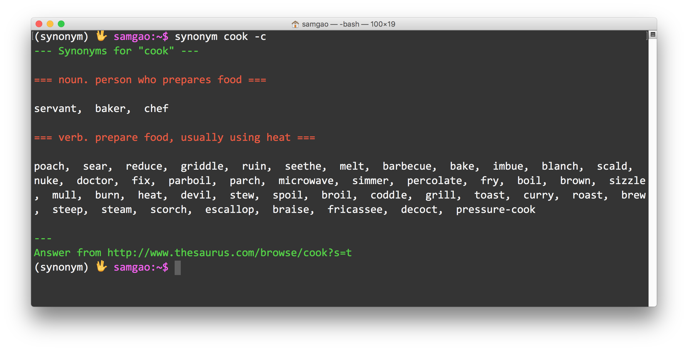

==========================================================
**synonym**: instant synonym answers via command line. 🖖
==========================================================

.. image:: https://img.shields.io/pypi/v/synonym.svg
        :target: https://pypi.python.org/pypi/synonym

.. image:: https://img.shields.io/travis/gavinzbq/synonym.svg
        :target: https://travis-ci.org/gavinzbq/synonym

.. image:: https://readthedocs.org/projects/synonym/badge/?version=latest
        :target: https://synonym.readthedocs.io/en/latest/?badge=latest
        :alt: Documentation Status

.. image:: https://pyup.io/repos/github/gavinzbq/synonym/shield.svg
     :target: https://pyup.io/repos/github/gavinzbq/synonym/
     :alt: Updates

**synonym** is nice because it allows you stay in the console.
If you love editing articles, essays and blogs using a console-based text editor, and from time to time 
find yourself searching
synonyms for verbs and adjectives, then it is for you.

.. image:: docs/img/synonym_2.png
        :alt: screenshot
        :align: center
        :width: 100 %
        :scale: 100 %

* Free software: MIT license
* Documentation: https://synonym.readthedocs.io.

Features
--------

* If the word was mispelled, **synonym** would give a guess.

* Limiting to a specific property (n., v., adj., adv.) is possible.

* **synonym** uses cache by default for faster access. Caching can be disabled by setting `SYNONYM_DISABLE_CACHE` environment variable. The cache is in `~/.cache/howdoi`.

* Powered by:

  - `thesaurus.com <http://www.thesaurus.com/>`_

* Beautiful terminal colors thanks to `crayons <https://github.com/kennethreitz/crayons>`_.

* Inspired by `howdoi <https://github.com/gleitz/howdoi>`_

Usage
-----

::
        
        usage: synonym [-h] [-p property] [the word of interest]

        positional arguments:
          The Word of Interest

        optional arguments:
          -h, --help            show this help message and exit
          -p, --property        the property of interest, choose from [n, v, adj, adv]
          -c, --color           enable colorized output

          -C, --clear-cache     clear the cache
          -v, --version         display the current version of synonym

Install
-------

::
        
        pip install synonym

Author
------

* `Shanyun Gao <http://soultomount.press/>`_

Credits
---------

This package was created with Cookiecutter_ and the `audreyr/cookiecutter-pypackage`_ project template.

.. _Cookiecutter: https://github.com/audreyr/cookiecutter
.. _`audreyr/cookiecutter-pypackage`: https://github.com/audreyr/cookiecutter-pypackage

